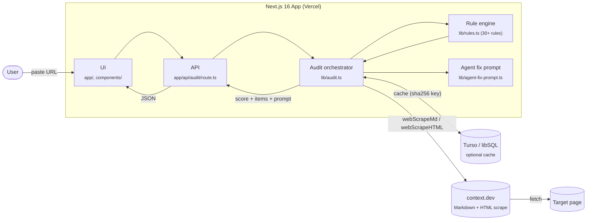

<div align="center">

# AI SEO Audit

**Score any URL for ChatGPT, Claude, and Perplexity visibility — then ship the fixes with your coding agent.**

[](./LICENSE)
[](https://nextjs.org/)
[](https://context.dev?utm_source=github&utm_medium=readme&utm_campaign=ai-seo-audit&utm_content=badge)

</div>

---

`ai-seo-audit` is a free, open-source web app that audits a page for **AI answer-engine readability** — the kind of optimization that gets you cited by ChatGPT, Claude, and Perplexity rather than ranked on Google. Paste a URL, get a 0–100 score across six categories (crawlability, content chunking, schema, E-E-A-T, off-site citations, and governance), then copy a generated fix prompt straight into your coding agent.

> Sometimes called **GEO** (Generative Engine Optimization) or **AEO** (Answer Engine Optimization).

## Demo

Paste a URL → get a score in ~30 seconds → copy the fix prompt into Claude Code, Cursor, or any agent.

```
┌──────────────────────────────────────────────────┐
│  https://example.com/post                        │  →  Score: 72 / 100  (Strong)
└──────────────────────────────────────────────────┘
   ├─ A. Technical AI Crawlability ..... 18.0 / 28.4
   ├─ B. Content Structure & Chunking .. 21.0 / 25.4
   ├─ C. Structured Data / Schema ...... 13.4 / 13.4
   ├─ D. E-E-A-T & Entity Authority ... 13.0 / 21.4
   ├─ E. Off-site / Citation Surface ... 3.6 / 8.4
   └─ F. Measurement & Governance ...... 3.0 / 3.0
```

## Features

- **30+ AI-readability checks** across crawlability, content chunking, schema markup, and trust signals.
- **Major AI crawlers covered**: GPTBot, OAI-SearchBot, ChatGPT-User, ClaudeBot, Claude-User, Claude-SearchBot, PerplexityBot, Google-Extended, Applebot-Extended.
- **Agent-ready fix prompt** — generated per audit, paste into Claude Code / Cursor / Aider to implement the fixes.
- **JSON API** at `/api/audit?domain=...` for CI pipelines and dashboards.
- **Edge-cached results** via optional Turso (libSQL) — repeat audits are instant.
- **Zero direct page fetches.** All web data flows through [context.dev](https://context.dev?utm_source=github&utm_medium=readme&utm_campaign=ai-seo-audit&utm_content=intro), giving you clean Markdown extraction and rendered HTML without running a headless browser yourself.

## Architecture



The app **never** hits the audited site directly — every byte of page content is fetched through `context.dev`, which handles rendering, robots compliance, and Markdown extraction.

| Layer        | File(s)                                                                          | Responsibility                                                               |
| ------------ | -------------------------------------------------------------------------------- | ---------------------------------------------------------------------------- |
| UI           | `app/page.tsx`, `components/audit-form.tsx`, `components/audit-results-view.tsx` | Form, score view, copy-paste prompt                                          |
| API          | `app/api/audit/route.ts`                                                         | `GET`/`POST` JSON endpoint, edge cache headers                               |
| Orchestrator | `lib/audit.ts`, `lib/perform-audit.ts`                                           | Pulls Markdown + HTML via context.dev, builds `RuleContext`, runs every rule |
| Rules        | `lib/rules.ts`                                                                   | Authoritative source for every check (edit this file to add/tune rules)      |
| Prompt       | `lib/agent-fix-prompt.ts`                                                        | Turns failing rules into a single copy-paste prompt for coding agents        |
| Cache        | `lib/turso.ts`                                                                   | Optional libSQL-backed cache, keyed by domain + schema version               |

## Getting started

### 1. Get a Context.dev API key

Context.dev handles the page fetch + Markdown extraction that powers the audit. It has a generous free tier.

👉 **[Sign up for context.dev](https://context.dev/signup?utm_source=github&utm_medium=readme&utm_campaign=ai-seo-audit&utm_content=signup-cta)**

After signing in, grab your API key from the dashboard.

### 2. Clone and install

```bash
git clone https://github.com/context-dot-dev/ai-seo-audit.git
cd ai-seo-audit
npm install
```

### 3. Configure environment

Copy the example file and fill in your key:

```bash
cp .env.example .env
```

```env
# .env
CONTEXT_DEV_API_KEY=ctx_sk_...          # required — from https://context.dev
NEXT_PUBLIC_SITE_URL=http://localhost:3000

# Optional: Turso (libSQL) cache. Without these, audits run live every time.
aiseo_TURSO_DATABASE_URL=
aiseo_TURSO_AUTH_TOKEN=
```

| Variable                   | Required | What it does                                                                                                                                                     |
| -------------------------- | -------- | ---------------------------------------------------------------------------------------------------------------------------------------------------------------- |
| `CONTEXT_DEV_API_KEY`      | ✅       | Authenticates Markdown + HTML scrapes via [context.dev](https://context.dev?utm_source=github&utm_medium=readme&utm_campaign=ai-seo-audit&utm_content=env-table) |
| `NEXT_PUBLIC_SITE_URL`     | ✅       | Canonical site URL used for OG tags and sitemap                                                                                                                  |
| `aiseo_TURSO_DATABASE_URL` | optional | libSQL database URL for caching audit results                                                                                                                    |
| `aiseo_TURSO_AUTH_TOKEN`   | optional | Paired auth token for the Turso database                                                                                                                         |

> **Turso is optional.** When the Turso variables are missing the app falls back to running a fresh audit on every request. For production, the [Vercel + Turso Marketplace integration](https://vercel.com/integrations/turso) wires both vars in automatically.

### 4. Run the dev server

```bash
npm run dev
```

Open [http://localhost:3000](http://localhost:3000) and paste a URL.

### 5. Build for production

```bash
npm run build
npm run start
```

## Usage

### Web UI

Visit `/`, paste a URL, hit **Audit**. Results live at `/audit/<domain>` and are shareable.

### JSON API

```bash
# GET
curl "http://localhost:3000/api/audit?domain=example.com"

# POST
curl -X POST http://localhost:3000/api/audit \
  -H "content-type: application/json" \
  -d '{"domain": "example.com"}'
```

Response shape (abbreviated):

```jsonc
{
  "status": "ready",
  "cached": false,
  "audit": {
    "url": "https://example.com/",
    "score": 72,
    "band": { "label": "Strong", "interpretation": "..." },
    "categories": [
      {
        "id": "A",
        "name": "Technical AI Crawlability",
        "score": 18.3,
        "maxScore": 28.4,
        "items": [
          /* per-rule */
        ],
      },
      {
        "id": "B",
        "name": "Content Structure & Chunking",
        "score": 21,
        "maxScore": 25.4,
      },
    ],
    "topPriorities": ["A11: Add a self-referencing canonical tag ...", "..."],
    "agentPrompts": { "full": "Paste this into your coding agent ..." },
  },
}
```

## Tech stack

- **[Next.js 16](https://nextjs.org/)** (App Router, React 19, server components)
- **[Tailwind CSS v4](https://tailwindcss.com/)**
- **[context.dev SDK](https://www.npmjs.com/package/context.dev)** for page fetching + Markdown extraction
- **[Turso](https://turso.tech/)** (libSQL) for optional edge-cached results
- **TypeScript** end-to-end

## Project structure

```
ai-seo-audit/
├─ app/
│  ├─ api/audit/route.ts        # JSON API
│  ├─ audit/[domain]/page.tsx   # Shareable results page
│  ├─ page.tsx                  # Landing + audit form
│  └─ layout.tsx, robots.ts, sitemap.ts
├─ components/
│  ├─ audit-form.tsx
│  └─ audit-results-view.tsx
├─ lib/
│  ├─ audit.ts                  # Orchestrator (fetch → parse → score)
│  ├─ perform-audit.ts          # Caching + error envelope
│  ├─ rules.ts                  # Every audit rule lives here
│  ├─ agent-fix-prompt.ts       # Builds the copy-paste fix prompt
│  ├─ turso.ts                  # Cache (libSQL)
│  └─ url.ts, brand.ts, ...
└─ public/                      # Favicons, OG images
```

## Adding or tuning a rule

All audit logic lives in `lib/rules.ts`. To add a check:

1. Append an entry to the `RULES` array.
2. Point its `categoryId` at an existing entry in `CATEGORIES`.
3. Implement `evaluate(ctx: RuleContext)` returning `{ status: 'pass' | 'partial' | 'fail' | 'na', evidence }`.
4. Optionally set `multiplier` to weight the rule inside its category.

Scoring, the UI breakdown, and the agent fix prompt all derive from this file — no other code needs to change.

## Deploy

The fastest path is **Vercel + Turso Marketplace**:

1. Click **Import** in Vercel, point it at your fork.
2. Add `CONTEXT_DEV_API_KEY` from [context.dev](https://context.dev?utm_source=github&utm_medium=readme&utm_campaign=ai-seo-audit&utm_content=deploy) under Project Settings → Environment Variables.
3. Add the **Turso** integration from the Vercel Marketplace — it provisions `aiseo_TURSO_DATABASE_URL` and `aiseo_TURSO_AUTH_TOKEN` for you.
4. Deploy.

Self-hosting works too — it's a standard Next.js app, runs anywhere Node 20+ runs.

## Contributing

Issues and PRs are welcome. Good first contributions:

- **New audit rules** in `lib/rules.ts` (cite a source for the heuristic in the PR description).
- **Better evidence strings** so the fix prompt gives agents more to work with.
- **Bug reports** with the URL audited + the score / category that surprised you.

Before opening a PR:

```bash
npm run lint
npm run typecheck
npm run build
```

## License

[MIT](./LICENSE) © Context.dev

---

<div align="center">
<sub>Built with <a href="https://context.dev?utm_source=github&utm_medium=readme&utm_campaign=ai-seo-audit&utm_content=footer">context.dev</a> · <a href="https://github.com/context-dot-dev/ai-seo-audit/issues">Report an issue</a></sub>
</div>
